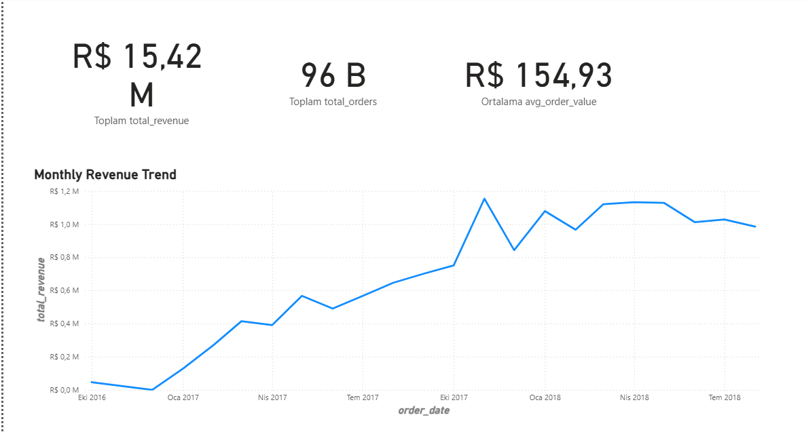
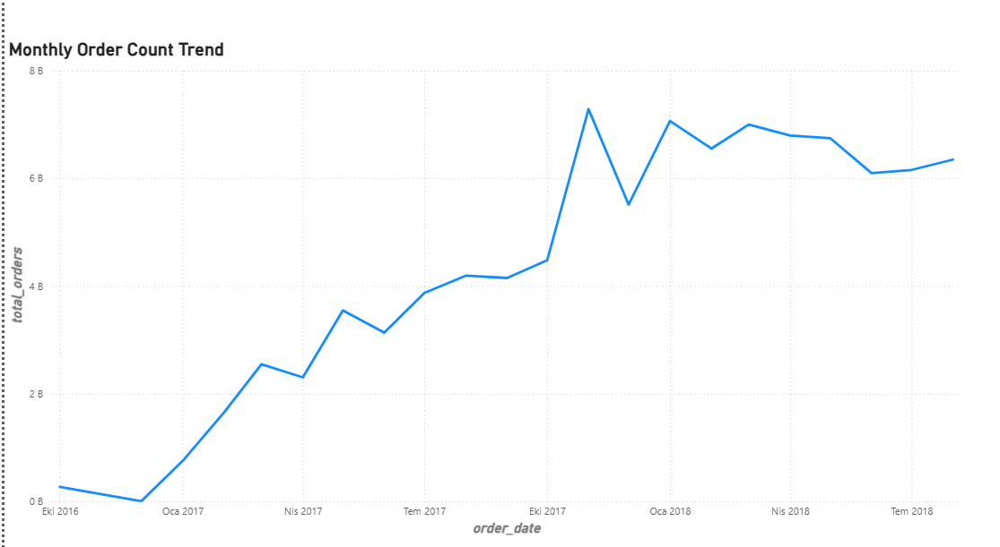
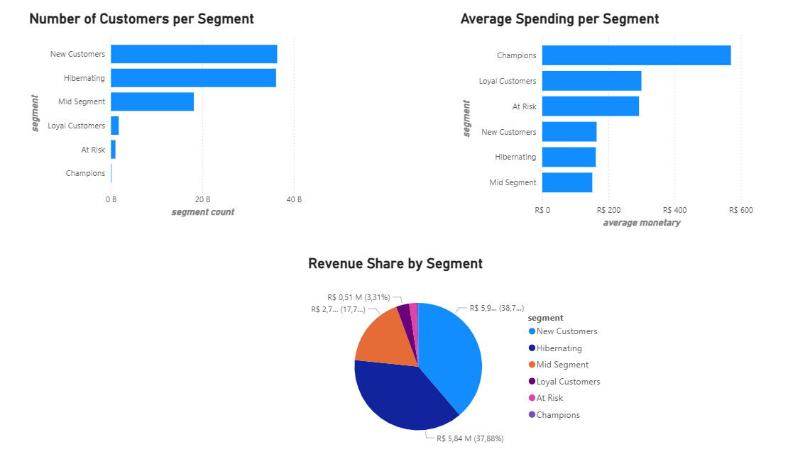
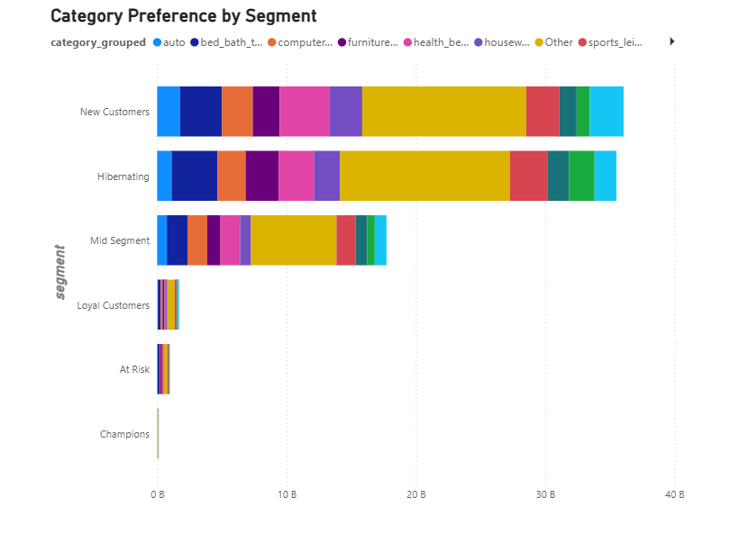
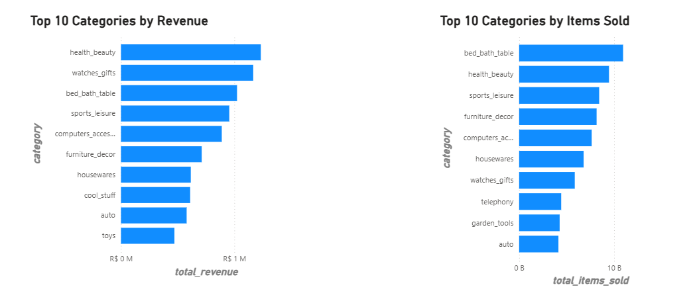
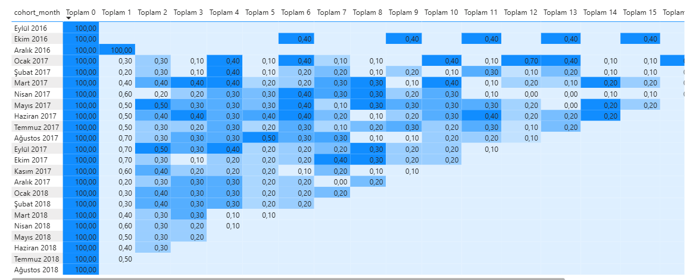

# E-Commerce Customer Behavior Analysis & Segmentation

A data analysis project that explores customer purchasing behavior on a real-world e-commerce dataset (Olist, Brazil) to identify which customers drive the most value, uncover retention issues, and turn these findings into a business-ready Power BI dashboard.

## Business Problem

E-commerce companies often focus on getting new customers, but keeping them can matter just as much. This project looks at real transaction data to answer a few key questions:
- Which customers bring in the most value?
- Do customers come back and buy again?
- Are spending patterns and product preferences different across customer groups?
- What can the business do with this information?

## Tools & Methods

- **SQL (MySQL):** Data cleaning, joining tables, and building the core datasets
- **Python (Pandas, SciPy):** RFM segmentation, hypothesis testing, cohort analysis
- **Power BI:** Interactive dashboard for business reporting

## Dataset

This project uses the [Brazilian E-Commerce Public Dataset by Olist](https://www.kaggle.com/datasets/olistbr/brazilian-ecommerce), which contains around 100,000 orders placed between 2016 and 2018. It includes order details, payments, products, and customer information.

## Methodology

### 1. Data Cleaning (SQL)
Raw CSV files were loaded into MySQL, cleaned, and checked for missing or duplicate values. Core tables were built for orders, customers, products, and payments.

### 2. RFM Segmentation (SQL + Python)
Customers were segmented using RFM analysis (Recency, Frequency, Monetary value) — a common method for measuring how valuable a customer is based on how recently, how often, and how much they buy. Each customer was scored and grouped into segments: Champions, Loyal Customers, At Risk, New Customers, Mid Segment, and Hibernating.

### 3. Hypothesis Testing (Python)
Two statistical tests were run to confirm the business findings weren't just due to chance:
- An **independent t-test** to check if repeat customers really spend more than one-time buyers
- A **chi-square test** to check if there's a real link between a customer's segment and the type of products they buy

### 4. Cohort & Retention Analysis (Python)
Customers were grouped by the month of their first purchase, and tracked over time to see how many came back in following months.

### 5. Dashboard (Power BI)
All findings were brought together into a 6-page interactive dashboard covering overall sales, customer segments, product performance, and retention.

---

## Key Findings

### Sales are growing steadily

Monthly revenue and order volume both show consistent growth from late 2016 into 2018, before leveling off in 2018.

Total revenue: **R$15.42M** | Total orders: **96K** | Average order value: **R$154.93**

Order count follows almost the same shape as revenue, which suggests growth came mainly from more customers ordering, not from customers spending more per order.

---

### Most customers only buy once

RFM segmentation showed that the vast majority of customers fall into low-frequency segments (New Customers and Hibernating), while only a small group (Champions, Loyal Customers, At Risk) has made more than one purchase.

A t-test confirmed this difference is statistically significant: repeat customers spend on average **R$308.59**, almost double what one-time buyers spend (**R$160.76**), with a p-value far below 0.05.

This means converting even a small share of one-time buyers into repeat customers could meaningfully boost revenue per customer.

---

### A small group of customers punches above its weight

Despite making up less than 1% of the customer base, Champions spend far more on average than any other segment — while New Customers and Hibernating together account for over 75% of total revenue simply due to their large numbers.

This gap between customer *volume* and customer *value* highlights an opportunity: loyalty programs for high-value segments, and win-back campaigns for the much larger low-value segments.

---

### Category preferences differ by segment

A chi-square test showed a statistically significant relationship between a customer's segment and the type of products they tend to buy (p < 0.0001), meaning marketing and recommendations could realistically be tailored by segment.

Health & beauty and watches/gifts are the top revenue-generating categories, while bed/bath/table products sell in higher volume but at lower price points.

---

### Retention is the biggest issue

This is the strongest finding in the project. Looking at customers grouped by the month of their first purchase, almost none return the following month — retention drops to under 1% by month one, and stays that low no matter which month the cohort started in.

In practical terms: out of every 1,000 new customers, only around 3 to 7 come back the next month. This pattern is consistent across nearly two years of data, which suggests it's an ongoing structural issue rather than something tied to a specific period.

---

## Business Recommendations

1. **Invest in retention**, not just acquisition — the data shows this is where the biggest opportunity lies, since almost all revenue currently comes from one-time purchases.
2. **Build a loyalty program** for Champions and Loyal Customers to protect and grow this small but highly valuable group.
3. **Run win-back campaigns** targeting Hibernating and At Risk customers, who haven't purchased in a long time but previously showed buying behavior.
4. **Tailor marketing by segment and category** — high-value segments respond differently to product categories than low-value ones.

---

## Repository Structure

├── sql/ → SQL scripts for data cleaning and metric calculation
├── notebooks/ → Jupyter notebook with RFM, hypothesis testing, and cohort analysis
├── powerbi/ → Power BI dashboard file (.pbix)
├── images/ → Dashboard screenshots
└── README.md

## How to Explore This Project

1. Check the `sql/` folder for the queries used to clean and prepare the data
2. Open the notebook in `notebooks/` to see the full analysis with explanations
3. Open the `.pbix` file in Power BI Desktop to explore the interactive dashboard

---

*All monetary values are in Brazilian Real (R$/BRL), as the dataset comes from a Brazilian e-commerce company.*
